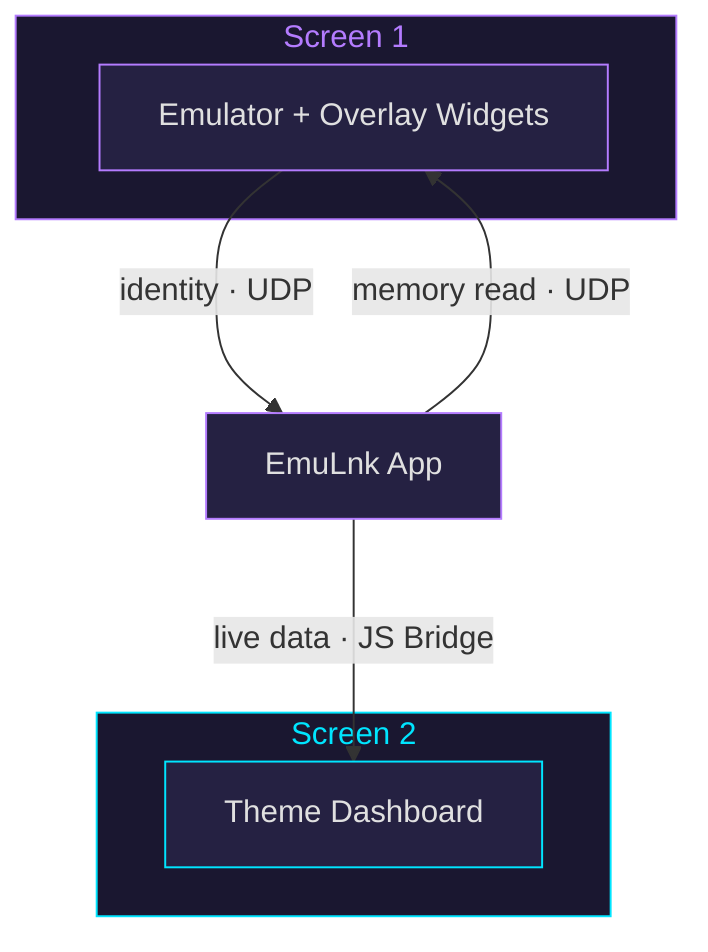

<p align="center">
  
</p>

<p align="center">
  <strong>The DS experience, for every emulator.</strong><br/>
  Show live game data on your second screen, or on top of the game.
</p>

<p align="center">
  <a href="https://github.com/EmuLnk/emulnk/releases"></a>
  &nbsp;
  
  &nbsp;
  
  &nbsp;
  <a href="https://github.com/EmuLnk/emulnk/releases"></a>
  <a href="https://discord.gg/Qn2KQBdwRH"></a>
</p>

<p align="center">
  <a href="https://apps.obtainium.imranr.dev/redirect?r=obtainium://app/%7B%22id%22%3A%22com.emulnk%22%2C%22url%22%3A%22https%3A%2F%2Fgithub.com%2FEmuLnk%2Femulnk%22%2C%22author%22%3A%22EmuLnk%22%2C%22name%22%3A%22EmuLnk%22%2C%22preferredApkIndex%22%3A0%2C%22additionalSettings%22%3A%22%7B%5C%22includePrereleases%5C%22%3Atrue%2C%5C%22fallbackToOlderReleases%5C%22%3Atrue%2C%5C%22filterReleaseTitlesByRegEx%5C%22%3A%5C%22%5C%22%2C%5C%22filterReleaseNotesByRegEx%5C%22%3A%5C%22%5C%22%2C%5C%22verifyLatestTag%5C%22%3Afalse%2C%5C%22sortMethodChoice%5C%22%3A%5C%22date%5C%22%2C%5C%22useLatestAssetDateAsReleaseDate%5C%22%3Afalse%2C%5C%22releaseTitleAsVersion%5C%22%3Afalse%2C%5C%22trackOnly%5C%22%3Afalse%2C%5C%22versionExtractionRegEx%5C%22%3A%5C%22%5C%22%2C%5C%22matchGroupToUse%5C%22%3A%5C%22%5C%22%2C%5C%22versionDetection%5C%22%3Atrue%2C%5C%22releaseDateAsVersion%5C%22%3Afalse%2C%5C%22useVersionCodeAsOSVersion%5C%22%3Afalse%2C%5C%22apkFilterRegEx%5C%22%3A%5C%22%5C%22%2C%5C%22invertAPKFilter%5C%22%3Afalse%2C%5C%22autoApkFilterByArch%5C%22%3Atrue%2C%5C%22appName%5C%22%3A%5C%22%5C%22%2C%5C%22appAuthor%5C%22%3A%5C%22%5C%22%2C%5C%22shizukuPretendToBeGooglePlay%5C%22%3Afalse%2C%5C%22allowInsecure%5C%22%3Afalse%2C%5C%22exemptFromBackgroundUpdates%5C%22%3Afalse%2C%5C%22skipUpdateNotifications%5C%22%3Afalse%2C%5C%22about%5C%22%3A%5C%22%5C%22%2C%5C%22refreshBeforeDownload%5C%22%3Afalse%7D%22%2C%22overrideSource%22%3A%22GitHub%22%7D"></a>
</p>

---

## What It Does

EmuLnk connects to emulators over UDP, reads game memory in real time, and renders it as themed HTML pages. It supports three modes: full-screen dashboards on a second screen, floating overlay widgets on top of the game, or both at once (bundle). Themes are HTML/CSS/JS WebViews driven by live data from JSON profiles. Themes can also write back to game memory, run macros, play sounds, and trigger haptic feedback.

<p align="center">
  <em>Screenshots coming soon</em>
</p>

## Supported Emulators

| Emulator | Systems | Fork |
|----------|---------|------|
| **RetroArch** | SNES, Genesis, NES, GB, GBC, GBA, PS1, N64 | [`retroarch-lnk`](https://github.com/EmuLnk/retroarch-lnk) |
| **Dolphin** | GameCube, Wii | [`dolphin-lnk`](https://github.com/EmuLnk/dolphin-lnk) |
| **PPSSPP** | PSP | [`ppsspp-lnk`](https://github.com/EmuLnk/ppsspp-lnk) |
| **melonDS** | NDS, DSi | [`melonds-lnk`](https://github.com/EmuLnk/melonDS-lnk) |
| **Azahar** | 3DS | [`azahar-lnk`](https://github.com/EmuLnk/azahar-lnk) |

> [!NOTE]
> Each emulator fork adds the EmuLnk binary UDP protocol. Install the fork alongside EmuLnk to use it.

## How It Works



1. **Detect**: Sends an EMLKV2 handshake over UDP; emulator responds with JSON containing `game_id`, `game_hash`, and `platform`
2. **Match**: Hash resolves to an exact profile, or serial falls back to a compatible one
3. **Poll**: Data points are read from emulator memory at a configurable rate (default 5 Hz)
4. **Render**: Live data is pushed to the theme WebView (full-screen dashboard or floating overlay widgets) via JavaScript bridge

## Installation

Download the latest APK from [Releases](https://github.com/EmuLnk/emulnk/releases) or import the full EmuLnk suite into [Obtainium](https://github.com/ImranR98/Obtainium):

> [!TIP]
> **[`obtainium.json`](obtainium.json)**: Includes EmuLnk app + all emulator forks + repo tracking, grouped under one category.
> If you imported EmuLnk before the package IDs were corrected, delete the affected RetroArch, Dolphin, or PPSSPP entries from Obtainium and re-import this file.

## Building from Source

```bash
git clone https://github.com/EmuLnk/emulnk.git
cd emulnk
./gradlew assembleDebug
```

Requires Android SDK 35 and JDK 11.

## Creating Themes

Themes are self-contained folders with HTML, CSS, JS, and a `theme.json` manifest. See the full documentation:

| Resource | Description |
|----------|-------------|
| [Getting Started](https://github.com/EmuLnk/emulnk-repo/wiki/Getting-Started) | First theme walkthrough |
| [Theme Format](https://github.com/EmuLnk/emulnk-repo/wiki/Theme-Format) | Manifest and file structure |
| [Theme API](https://github.com/EmuLnk/emulnk-repo/wiki/Theme-API) | Data contract and updateData() |
| [Bridge Methods](https://github.com/EmuLnk/emulnk-repo/wiki/Bridge-Methods) | JavaScript bridge reference (`emulink.*`) |
| [Profile Format](https://github.com/EmuLnk/emulnk-repo/wiki/Profile-Format) | Data point definitions |
| [Platform Quirks](https://github.com/EmuLnk/emulnk-repo/wiki/Platform-Quirks) | System-specific memory notes |

Browse community themes and profiles in [`emulnk-repo`](https://github.com/EmuLnk/emulnk-repo).

## Project Repos

| Repo | Description |
|------|-------------|
| **`emulnk`** | **Android companion app** |
| [`emulnk-repo`](https://github.com/EmuLnk/emulnk-repo) | Themes, profiles, and system configs |
| [`retroarch-lnk`](https://github.com/EmuLnk/retroarch-lnk) | RetroArch fork with UDP protocol |
| [`dolphin-lnk`](https://github.com/EmuLnk/dolphin-lnk) | Dolphin fork with UDP protocol |
| [`ppsspp-lnk`](https://github.com/EmuLnk/ppsspp-lnk) | PPSSPP fork with UDP protocol |
| [`melonds-lnk`](https://github.com/EmuLnk/melonDS-lnk) | melonDS fork with UDP protocol |
| [`azahar-lnk`](https://github.com/EmuLnk/azahar-lnk) | Azahar fork with UDP protocol |

## License

[PolyForm Noncommercial License 1.0.0](LICENSE)

